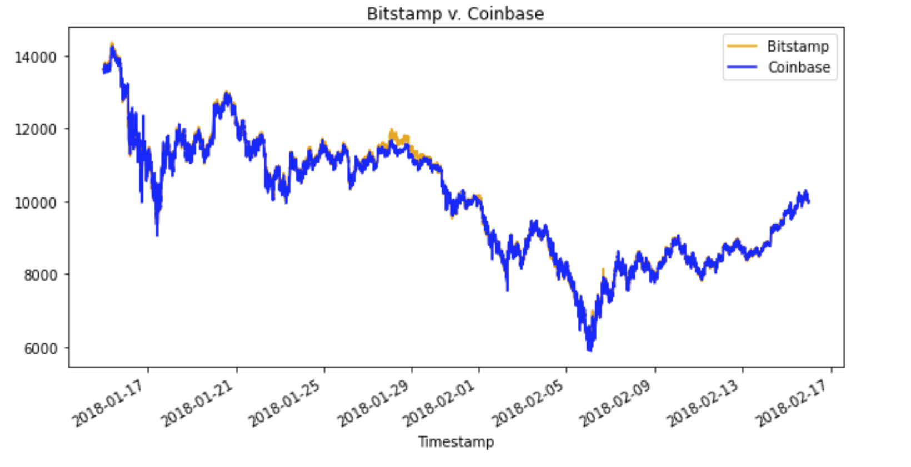
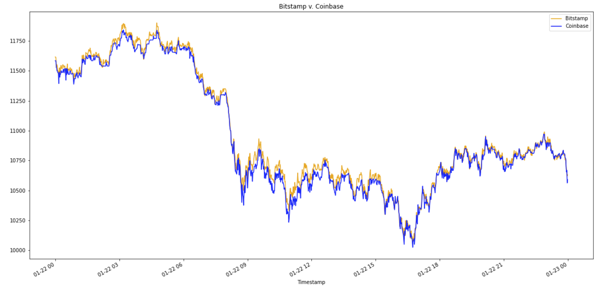
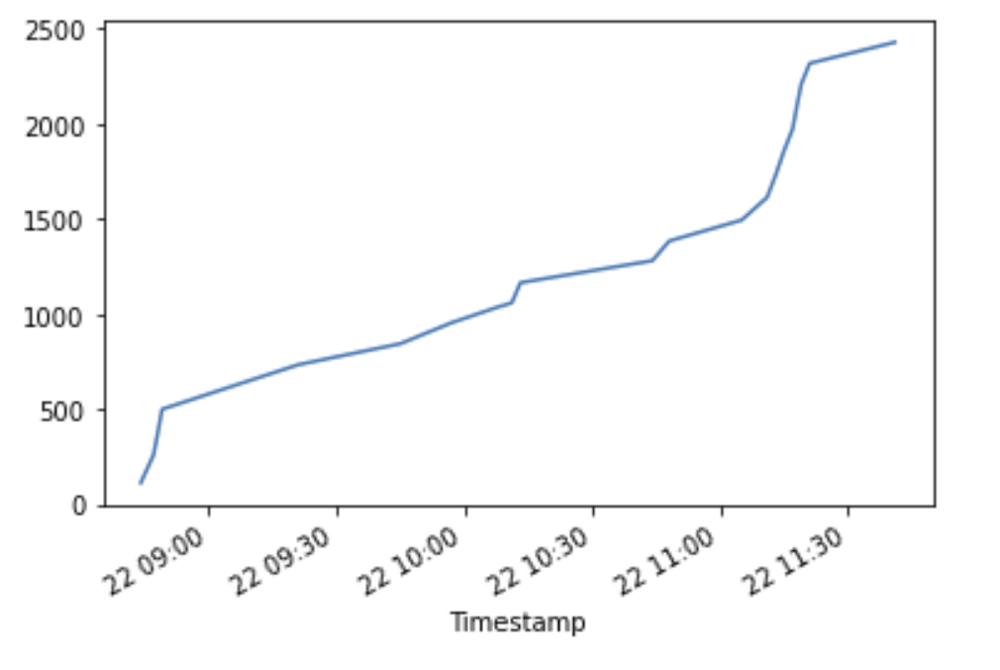

# bitcoin_arbitrage_analysis

This is an analysis report that uses jupyter labs to determine the feasibility of profitable arbitrage opportunities across two popular cryptocurrency exchanges during the first quarter of 2018.
This report works by analyzing bitstamp.csv and coinbase.csv which show the price action of bitcoin on their respective exchange.
It first cleans the data and then puts it through multiple filters, utilizing visualizations to show feasibility of profitable arbitrage opportunities.

---

## Technologies

This project leverages python 3.7 with the following packages:

* [pandas] (https://github.com/pandas-dev/pandas) - For cleaning and filtering the data.

* [mathplotlib] (https://github.com/ipython/matplotlib-inline) - For visualizing data sets.

* [pathlib] (https://github.com/budlight/pathlib) - For importing cvs files using standarized file path notation.

---

## Datasets

coinbase.csv shows the bitcoin price actions from 2018-01-01 to 2018-04-01 on the Coinbase exchange.
bitstamp.csv shows the bitcoin price actions from 2018-01-01 to 2018-04-01 on the Bitstamp exchange.

## Ussage

Upon launching the crypto_arbitrage.ipynb run each cell sequentially.

## Analysis

Here is a chart showing an overview of price differences of BTC between two exchanges. These are potential opportunities for arbitrage.

This chart shows the arbitrage oportunites zoomed in.

This graph show the cumulative profit if we were to successfully take each arbitrage opportunity (without accounting for trading fees).

